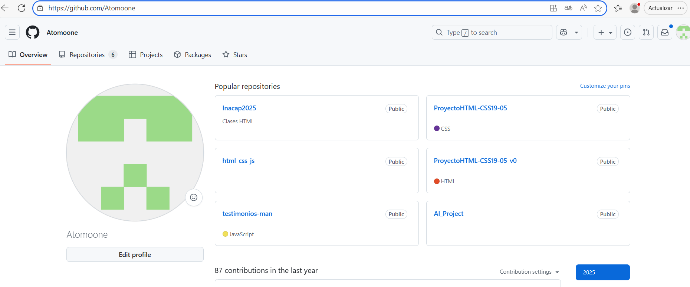
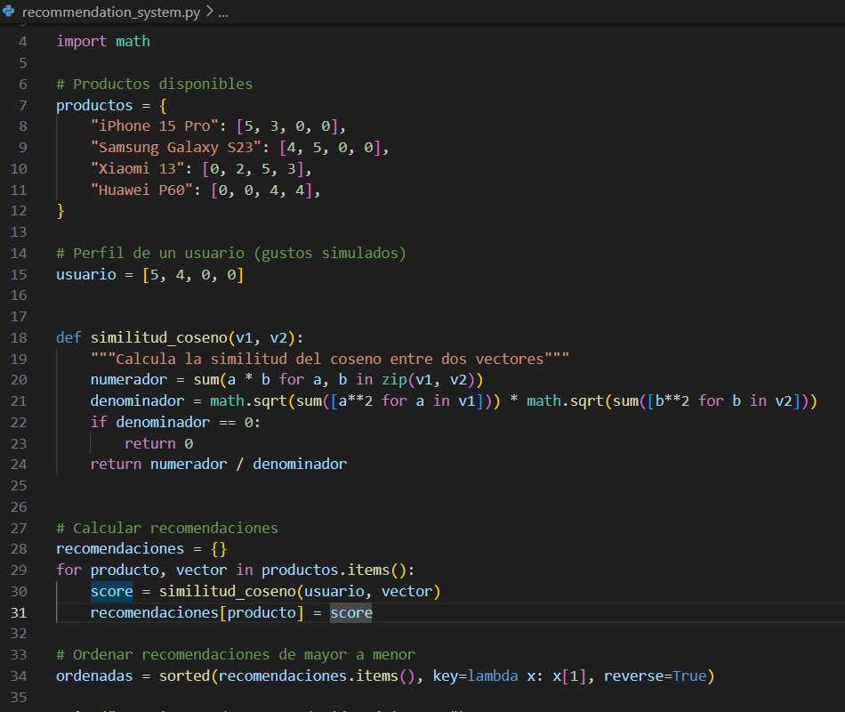
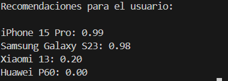

# AI_Project - Sistema de Recomendación Básico con GitHub Copilot

Este proyecto es una actividad  donde se utiliza GitHub Copilot, para generar código inicial en Python.  
El objetivo es explorar el uso de Copilot y documentar el proceso.

##  Pasos realizados

1. **Ingreso a GitHub**  
   - Se creó una cuenta de estudiante y se activó GitHub Copilot.  
   -

2. **Creación del repositorio**  
   - Se creó el repositorio llamado `AI_Project`.  
   - Se agregó archivo `README.md`.  
   - 

3. **Clonación en Visual Studio Code**  
   ```bash
   git clone https://github.com/Atomoone/AI_Project
   cd AI_Project


4. **Creación de archivo con Copilot

   Archivo: recommendation_system.py

Se pidió a Copilot:

# Crear un sistema de recomendación básico en Python usando listas


    Copilot generó el código base mostrado en este repositorio.
 - 

5. Commit y Push
 Con los siguientes comando, dentro de la consola de VS, se actualizan los cambios en el repositorio.

git add .
git commit -m "Proyecto con GitHub Copilot"
git push origin main

▶️ Ejecución

Para probar el sistema de recomendación:
Abre una terminal en la carpeta del proyecto (AI_Project).

Ejecuta:
python recommendation_system.py


Ejemplo de salida:



# Créditos

Estudiante: Pablo Mora González
Asignatura: 2025/P Tendencias de Inteligencia Artificial Aplicada (ETVI02/AOL-ELE-ETVI02-C3434 - Ciclo I/V Virtual ELE).
Actividad: Unidad 3 - Semana 8 - Actividad Formativa GitHub Copilot
